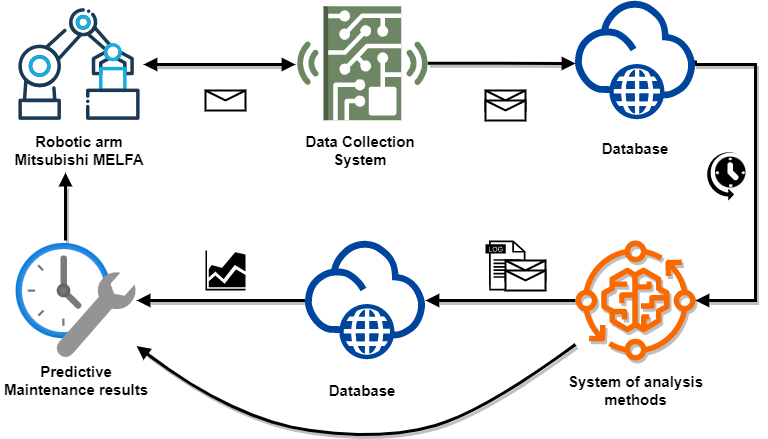
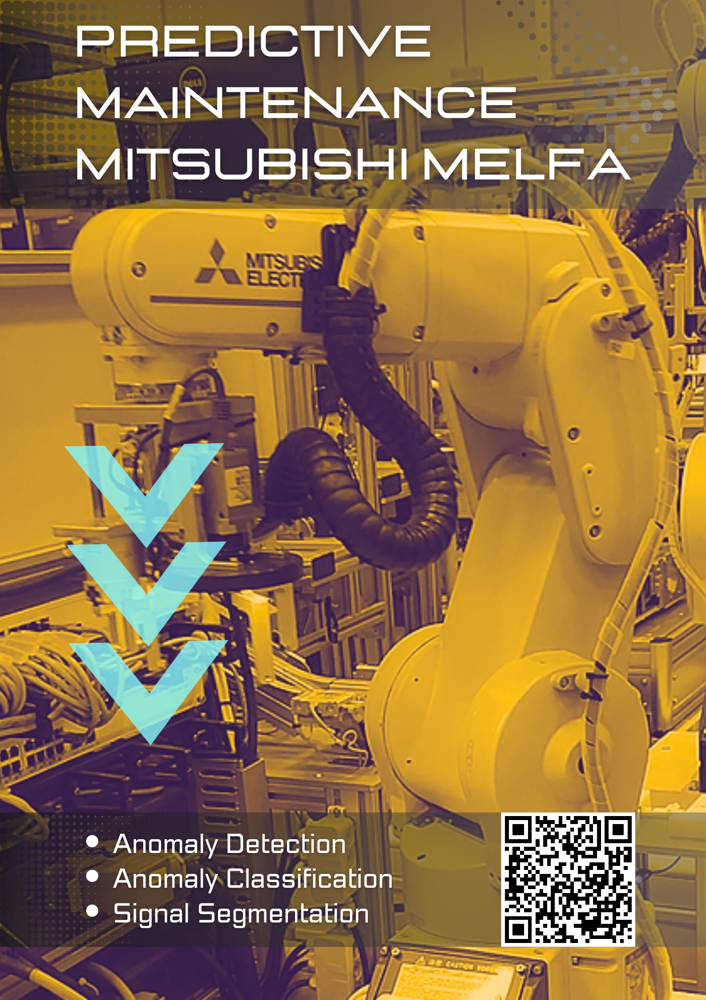

# Predictive Maintenance: Mitsubishi MELFA

This work deals with predictive maintenance of Mitsubishi MELFA 
robotic arms, where the entire process consists of monitored devices, 
a data collection system, databases, system of analysis methods, and 
interpretation of results.

The data collection system uses custom libraries, [slmpclient](https://pypi.org/project/slmpclient/) and [mitsubishi-monitor](https://pypi.org/project/mitsubishi-monitor/), for communicating with the robotic arms and obtaining energy consumption.
This code only contains a system of analysis methods which uses the following algorithms to obtain corresponding information about the condition and maintenance needs of monitored devices:
* Anomaly Detection - Convolutional Autoencoder
* Anomaly Classification - Convolutional neural network
* Extracting segments of movement - Hidden Markov Models

The obtained information about the condition of monitored devices is then transformed into severity levels, which can be applied in deciding the time frame for when the monitored devices will continue to function.
The entire documentation and description of the development of predictive maintenance of Mitsubishi MELFA robotic arms is in Slovak language, located here: https://www.vut.cz/studenti/zav-prace/detail/143131.

